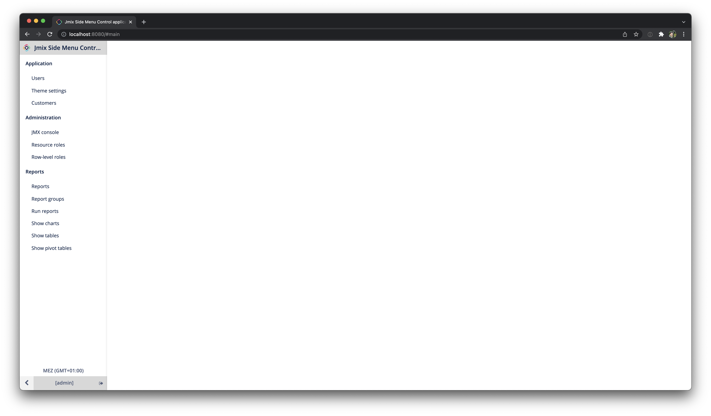
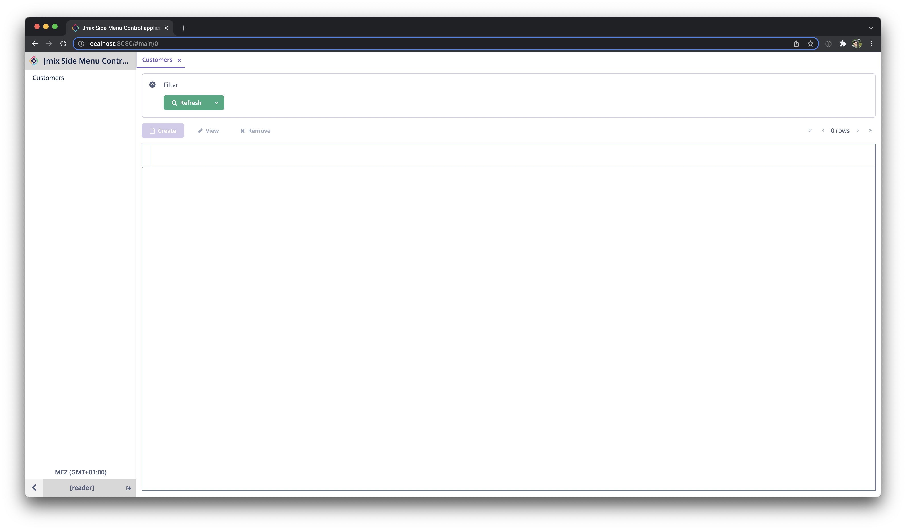
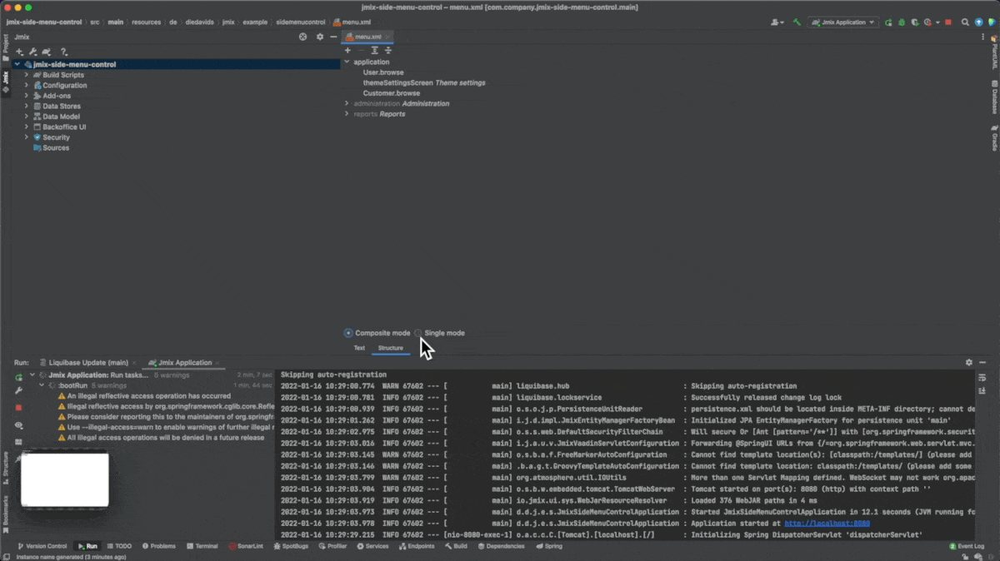
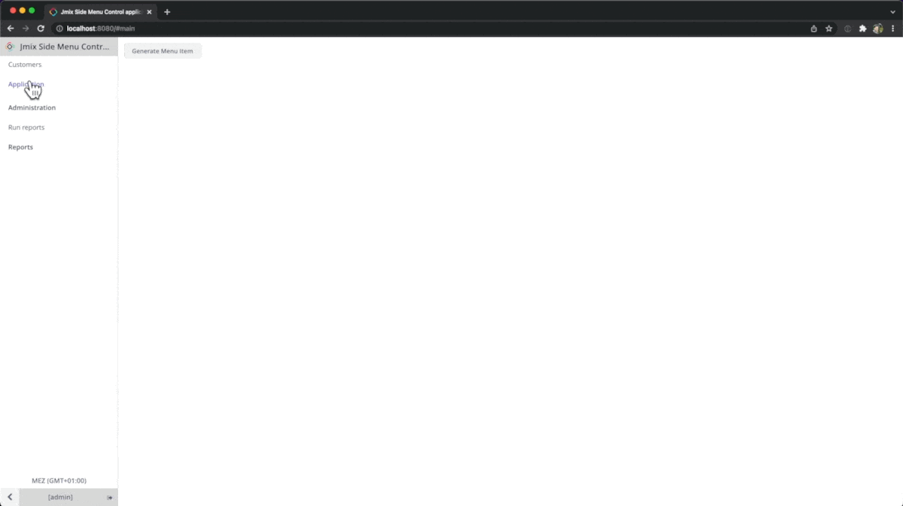

# Jmix Example: Side Menu Control

This example shows how to control the side menu customizations can be done.

## How it looks originally:



## Option 1: Resource Roles

By using Resource Role definition, you can show / hide particular menu entries through role definitions. 
More information on roles: https://docs.jmix.io/jmix/security/resource-roles.html#menu-policy.

see: [CustomerReadRole.java](src/main/java/de/diedavids/jmix/example/sidemenucontrol/security/CustomerReadRole.java)

```java
@ResourceRole(name = "CustomerReadRole", code = "customer-read-role")
public interface CustomerReadRole {
    @EntityAttributePolicy(entityClass = User.class, attributes = "*", action = EntityAttributePolicyAction.MODIFY)
    @EntityPolicy(entityClass = User.class, actions = EntityPolicyAction.ALL)
    void user();


    @MenuPolicy(
            menuIds = {"Customer.browse"}
    )
    @ScreenPolicy(
            screenIds = {"Customer.browse"})
    void customer();
}
```



## Option 2: Studio: Single Mode

In this case you can use the Single mode mechanism to copy all menu entries from jmix and its addons into your XML file.
Afterwards you can adjust them in any shape you need.




see: [menu.xml](src/main/resources/de/diedavids/jmix/example/sidemenucontrol/menu.xml)
```xml

    <item screen="Customer.browse"
          caption="msg://de.diedavids.jmix.example.sidemenucontrol.screen.customer/customerBrowse.menu"/>

    <menu id="application" caption="msg://de.diedavids.jmix.example.sidemenucontrol/menu.application">
        <item screen="themeSettingsScreen" caption="msg://io.jmix.ui.app.themesettings/themeSettings.caption"/>
    </menu>
    <menu id="administration">

        <!--
        1. change item order
        -->
        <item screen="sec_RowLevelRoleModel.browse"
              caption="msg://io.jmix.securityui/menu.sec_RowLevelRoleModel.browse"/>

        <!--
        2. remove items
        <item screen="ui_JmxConsoleScreen"/>
        -->

        <!--
        3. change item caption
        -->
        <item screen="sec_ResourceRoleModel.browse"
              caption="msg://de.diedavids.jmix.example.sidemenucontrol/myResourceRoleCaption"/>

        <!--
        4. put item into administration
        -->
        <item screen="User.browse"
              caption="msg://de.diedavids.jmix.example.sidemenucontrol.screen.user/UserBrowse.caption"/>
    </menu>


    <!--
    4. put items to the top menu
    -->
    <item id="report_Report.run" caption="msg://io.jmix.reportsui/menu.report_Report.run"/>

    <menu id="reports" caption="msg://io.jmix.reportsui/menu.reports">
        <item id="report_Report.browse" caption="msg://io.jmix.reportsui/menu.report_Report.browse"/>
        <item id="report_ReportGroup.browse" caption="msg://io.jmix.reportsui/menu.report_ReportGroup.browse"/>
        <item id="report_ShowChart.screen" caption="msg://io.jmix.reportsui/menu.report_ShowChart.screen"/>
        <item id="report_ShowReportTable.screen" caption="msg://io.jmix.reportsui/menu.report_ShowReportTable.screen"/>
        <item id="report_ShowPivotTable.screen" caption="msg://io.jmix.reportsui/menu.report_ShowPivotTable.screen"/>
    </menu>
```

## Option 3: Side Menu API

The Side Menu component has an API to interact with. This way you can control everything that is displayed in there programmatically.

The code is normally executed in the Main Screen, where the Side Menu component is located.




see: [MainScreen.java](src/main/java/de/diedavids/jmix/example/sidemenucontrol/screen/main/MainScreen.java).

```java

@UiController("MainScreen")
@UiDescriptor("main-screen.xml")
@Route(path = "main", root = true)
public class MainScreen extends Screen implements Window.HasWorkArea {

    @Autowired
    private SideMenu sideMenu;
    @Autowired
    private MessageBundle messageBundle;
    @Autowired
    private Notifications notifications;

    //...


    @Subscribe("generateMenuItem")
    public void onGenerateMenuItemClick(Button.ClickEvent event) {
        final UUID randomId = UUID.randomUUID();
        final SideMenu.MenuItem helloWorld = sideMenu.createMenuItem("helloWorld" + randomId);

        helloWorld.setCaption(messageBundle.formatMessage("helloWorld", randomId));
        helloWorld.setCommand(menuItem -> {
            notifications.create(Notifications.NotificationType.TRAY)
                    .withCaption(messageBundle.formatMessage("hello", randomId))
                    .show();
        });

        sideMenu.addMenuItem(helloWorld);
    }
}

```

